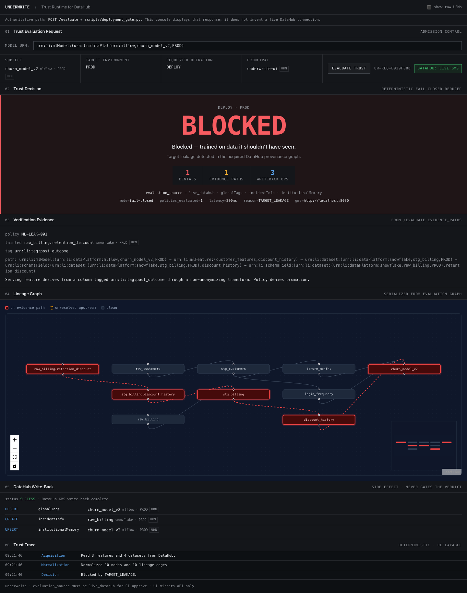
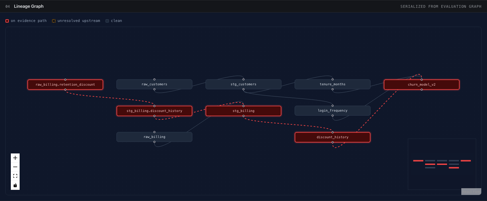
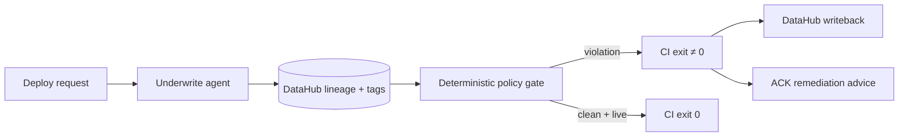

# Underwrite

> **DataHub knows where your ML features came from. Underwrite makes CI act on that knowledge.**

**Verified pin for judges:** tag [`freeze-grand-prize-ready`](https://github.com/Dhruva-Aher/UnderWrite/tree/freeze-grand-prize-ready) (prefer the tag over drifting `main`). Real captured responses, no DataHub required to read them: [`examples/sample_outputs/`](examples/sample_outputs/).

```bash
git clone --branch freeze-grand-prize-ready https://github.com/Dhruva-Aher/UnderWrite.git
```

**Target leakage is the demonstration. Metadata-backed deployment authorization is the product.**

An ML feature can look safe in code. DataHub already holds the multi-hop path to post-outcome data. Underwrite turns that provenance into a CI decision — then writes the outcome back into DataHub.

```text
Observe → Reason → Act → Remember → Assist
DataHub   Trace +   Block    Write to    ACK remediation
context   policy    deploy   DataHub     (after a block)
```

The LLM never authorizes. Authorization is deterministic and fail-closed over live DataHub evidence.

### How to evaluate (pick one)

| Path | Time | Needs DataHub? | What you get |
| --- | ---: | :---: | --- |
| **Fastest** — open [`examples/sample_outputs/`](examples/sample_outputs/) + screenshots below | ~30s | No | Real captured live `POST /evaluate` + gate exit codes |
| **Offline sanity** — `python demo/run_demo.py --offline` | ~1 min | No | Same policy engine; **cannot** produce a CI approval |
| **Full reproduction** — Quick Start below (DataHub Quickstart + seed) | ~15–30 min | Yes | Live GMS evidence, gate exit codes, catalog write-back |

The capture below is real, against a seeded DataHub quickstart: one deterministic verdict, the lineage evidence that caused it, and the write-back that recorded it.



More captures (all generated by `python scripts/capture_console.py`, which fails if the page logs a single error): [`docs/screenshots/`](docs/screenshots/).

---

## Why CI alone cannot solve this

```text
raw outcome column
      ↓ renamed
      ↓ aggregated
      ↓ feature store
      ↓
   ML model
```

Code review sees a benign feature name. DataHub knows the poisoned ancestor. Underwrite is the authorization boundary between them.

| | Ordinary CI | Underwrite |
| :--- | :---: | :---: |
| Compiles / tests | ✓ | ✓ |
| Reads DataHub fine-grained lineage | ✗ | **✓** |
| Deterministic policy verdict | ✗ | **✓** |
| Blocks unsafe ML deploy (non-zero exit) | ✗ | **✓** |
| Writes incidents back to DataHub | ✗ | **✓** |

**DataHub provides the evidence. Underwrite decides. CI enforces.**

---

## Quick Start (live DataHub — full reproduction)

**Prerequisite:** a running [DataHub Quickstart](https://docs.datahub.com/docs/quickstart) with GMS at `http://localhost:8080` (or set `UNDERWRITE_GMS_URL`). Without GMS, use the Fastest / Offline paths above — do not expect an approval.

Local Quickstart has **no SSO** and no shared login for judges. The DataHub UI at `http://localhost:9002` is open once containers are healthy. Leave `UNDERWRITE_DATAHUB_TOKEN` empty unless your GMS requires a personal access token. Do not point this demo at a corporate/cloud DataHub that needs SSO — judges will not have your credentials.

Validated on **Python 3.13** (the version used for the live demo pin).

```bash
python -m venv .venv && source .venv/bin/activate
pip install -r requirements.txt
cp .env.example .env   # local Quickstart: leave DATAHUB_TOKEN blank

python seed.py         # ingest the demo lineage into GMS
python preflight.py    # starts the API once GMS is healthy
```

The seeded models cover the whole decision space. Run the gate against each:

```bash
# 1. Target leakage — exits 1
python scripts/deployment_gate.py \
  --model-urn 'urn:li:mlModel:(urn:li:dataPlatform:mlflow,churn_model_v2,PROD)'

# 2. Same model with the leaked feature removed — exits 0
python scripts/deployment_gate.py \
  --model-urn 'urn:li:mlModel:(urn:li:dataPlatform:mlflow,churn_model_v2_fixed,PROD)'

# 3. Unresolvable lineage — exits 1, fail-closed
python scripts/deployment_gate.py \
  --model-urn 'urn:li:mlModel:(urn:li:dataPlatform:mlflow,fraud_model_v3,PROD)'

# 4. Unrelated clean model — exits 0
python scripts/deployment_gate.py \
  --model-urn 'urn:li:mlModel:(urn:li:dataPlatform:mlflow,recommendation_model_v1,PROD)'
```

Scenario 1 traverses DataHub fine-grained lineage from the model back to a column
tagged `post_outcome`, prints the evidence path with a browsable DataHub link,
writes an incident back to the offending dataset, and exits non-zero. Scenario 2 is
the same model after remediation: same gate, same policies, clean provenance, exit 0.
The gate is not always red.

**Exit 0 requires `verdict == approved` *and* `evaluation_source == live_datahub`.**
A model that looks clean because GMS was unreachable is blocked, not approved —
scenario 3 exists to prove that.

### In CI

The gate ships as a GitHub Action ([`action.yml`](action.yml)):

```yaml
- uses: Dhruva-Aher/UnderWrite@freeze-grand-prize-ready
  with:
    model-urn: 'urn:li:mlModel:(urn:li:dataPlatform:mlflow,churn_model_v2,PROD)'
    api-url: ${{ secrets.UNDERWRITE_API_URL }}
```

It exposes `verdict`, `reason_code`, `decision_id`, `latency_ms`, and
`evaluation_source` as step outputs, and fails the job on any blocked or
non-live evaluation.

### The console

With the API up, open <http://127.0.0.1:8000>. It renders the same `/evaluate`
response the gate consumes; the red path is the lineage that caused the block,
traced from the model back to a column tagged `post_outcome`.



The console never invents a connection: it displays `evaluation_source` verbatim,
and its write-back panel polls for the real outcome rather than claiming success.

### Offline fixture (reproducibility only)

```bash
python demo/run_demo.py --offline
```

This uses an in-memory mock. It is **not** a live DataHub evaluation, and the gate
will refuse to approve on it. Prefer the live path above for judging.

---

## API

| Endpoint | Purpose |
| --- | --- |
| `POST /evaluate` | Acquire lineage, evaluate policies, return the verdict and its evidence |
| `GET /writeback/{request_id}` | Real outcome of the background DataHub write-back for that evaluation |
| `POST /remediation/{decision_id}` | LLM remediation advice for a blocked decision — advisory only |
| `POST /override` | Record a token-authenticated override statement in DataHub; requires `UNDERWRITE_OVERRIDE_TOKEN` |
| `GET /health` | Reports whether GMS is reachable |

Write-back is a pure side effect. It runs after the response is sent and can fail
without changing a verdict that was already issued.

---

## Configuration

Set in `.env` or the environment.

| Variable | Default | Purpose |
| --- | --- | --- |
| `UNDERWRITE_GMS_URL` | `http://localhost:8080` | DataHub GMS endpoint |
| `UNDERWRITE_DATAHUB_TOKEN` | — | Personal access token, if GMS requires auth |
| `UNDERWRITE_MAX_LINEAGE_DEPTH` | `6` | Traversal depth bound |
| `UNDERWRITE_POLICY_PATH` | `policies.yaml` | Policy definitions |
| `UNDERWRITE_OVERRIDE_TOKEN` | — | Enables `/override` audit writes; endpoint is disabled without it |
| `UNDERWRITE_DATAHUB_UI_URL` | `http://localhost:9002` | Used by the gate to print browsable entity links |
| `UNDERWRITE_REQUESTED_BY` | CI actor, else `ci-deployment-gate` | Principal recorded in the audit trail |

---

## Tests

```bash
pytest
```

70 tests, verified with `pytest` from a clean `python3.13 -m venv` install of this
pinned `requirements.txt`: 67 run with no network, and 3 live-GMS integration tests
skip at collection unless DataHub is reachable. They cover the fail-closed
boundaries (a blocked verdict cannot be rendered as approved, the gate cannot exit 0
on a non-live source), URN handling, write-back plan/executor parity, and
request-scoped write-back deduplication.

---

## Architecture (five stages)

**Acquisition → Normalization → Traversal → Evaluation → Verdict**

Underwrite is the deployment agent; the policy gate inside it is deliberately non-LLM so authorization stays deterministic and fail-closed.



Full design notes: [`docs/ARCHITECTURE.md`](docs/ARCHITECTURE.md) · algorithm: [`docs/algorithm.md`](docs/algorithm.md)

---

## Development

The console is a Vite/React app in `web/frontend`. FastAPI serves a prebuilt,
content-hashed bundle from `web/static`, so rebuild after any UI change:

```bash
./scripts/build_frontend.sh    # build and sync into web/static
```

To refresh the screenshots in `docs/screenshots/`, with the API running:

```bash
python scripts/capture_console.py
```

It drives both paths in a real browser and exits non-zero on any page error,
console error, or failed request — a screenshot cannot be captured from a broken
page. Sample outputs in `examples/sample_outputs/` are regenerated the same way,
by piping live responses to disk; see the README there.

---

## FAQ

**Is the product target leakage detection?**  
Target leakage is the demonstrated policy. The product is metadata-backed deployment authorization: DataHub provides the evidence; Underwrite decides; CI enforces.

**Where is the agent?**  
Observe (DataHub context) → Reason (trace + policy) → Act (block deploy) → Remember (write-back) → Assist (ACK remediation). The LLM is reserved for Assist; it cannot override the verdict.

**What happens if DataHub is down?**  
Every deployment is blocked. Exit 0 requires `verdict == approved` *and* `evaluation_source == live_datahub`.

**Can someone bypass a block?**  
Not through the deployment gate. `/override` records a token-authenticated override statement in DataHub for audit; it does not change the verdict or make the gate exit 0. Disabled unless `UNDERWRITE_OVERRIDE_TOKEN` is set.

---

## License

Apache 2.0
