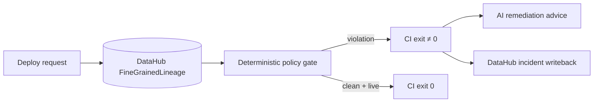

# Underwrite

> **DataHub already knows how your data is connected. Underwrite makes that knowledge enforceable.**

**Verified pin for judges:** tag [`freeze-grand-prize-ready`](https://github.com/Dhruva-Aher/UnderWrite/releases/tag/freeze-grand-prize-ready) · commit `f09ad46` (prefer the tag over drifting `main`). Sample live-shaped outputs: [`examples/sample_outputs/`](examples/sample_outputs/).

An ML feature can look safe in code. DataHub shows that three transformations upstream it derives from post-outcome data. Underwrite discovers that lineage and fails CI before the corrupted model deploys.

---

## Why CI alone cannot solve this

```text
raw outcome column
      ↓ renamed
      ↓ aggregated
      ↓ feature store
      ↓
   ML model
```

By the time the feature reaches the model, the dangerous relationship is invisible to code review. **Underwrite turns DataHub lineage into a CI authorization boundary** — not a report.

| | Ordinary CI | Underwrite |
| :--- | :---: | :---: |
| Compiles / tests | ✓ | ✓ |
| Reads DataHub fine-grained lineage | ✗ | **✓** |
| Deterministic policy verdict | ✗ | **✓** |
| Blocks unsafe ML deploy (non-zero exit) | ✗ | **✓** |
| Writes incidents back to DataHub | ✗ | **✓** |

**DataHub evidence determines authorization. AI explains remediation.** The LLM cannot decide whether deployment succeeds.

---

## Quick Start (live DataHub — the path judges should run)

Requires DataHub GMS (default `http://localhost:8080`). Python 3.13 recommended.

```bash
python -m venv .venv && source .venv/bin/activate
pip install -r requirements.txt
cp .env.example .env   # set UNDERWRITE_GMS_URL / token if needed

python seed.py                    # ingest demo lineage into GMS
python demo/run_demo.py           # live: traverse → verdict → writeback
python preflight.py               # starts API when GMS is healthy
python scripts/deployment_gate.py \
  --model-urn 'urn:li:mlModel:(urn:li:dataPlatform:mlflow,churn_model_v2,PROD)'
```

Expected shape: connect to GMS → evaluate `churn_model_v2` → **BLOCKED** with evidence paths → **live** DataHub writeback → gate exits non-zero.

Exit 0 only when `verdict == approved` **and** `evaluation_source == live_datahub`.

Optional UI: with the API up, open the app. The console calls `POST /evaluate` and displays `evaluation_source` honestly — it does not invent a live DataHub connection.

### Offline fixture (reproducibility only)

```bash
python demo/run_demo.py --offline
```

This uses an in-memory mock. It is **not** a live DataHub evaluation. Prefer the live path above for judging.

---

## Architecture (five stages)

**Acquisition → Normalization → Traversal → Evaluation → Verdict**



Full design notes: [`docs/ARCHITECTURE.md`](docs/ARCHITECTURE.md) · algorithm: [`docs/algorithm.md`](docs/algorithm.md)

---

## FAQ

**Is this just a leakage detector?**  
No. Target leakage is the demonstrated policy. The product is **metadata-backed deployment policy enforcement** — DataHub decides; CI enforces.

**Why not ask an LLM whether the model looks dangerous?**  
Authorization must be deterministic and fail-closed. AI runs only after a block, read-only via Agent Context Kit.

---

## License

Apache 2.0
