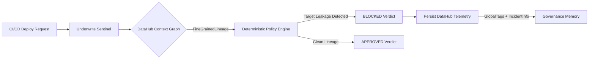
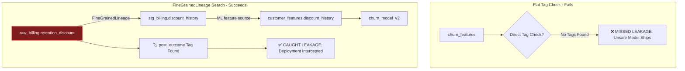
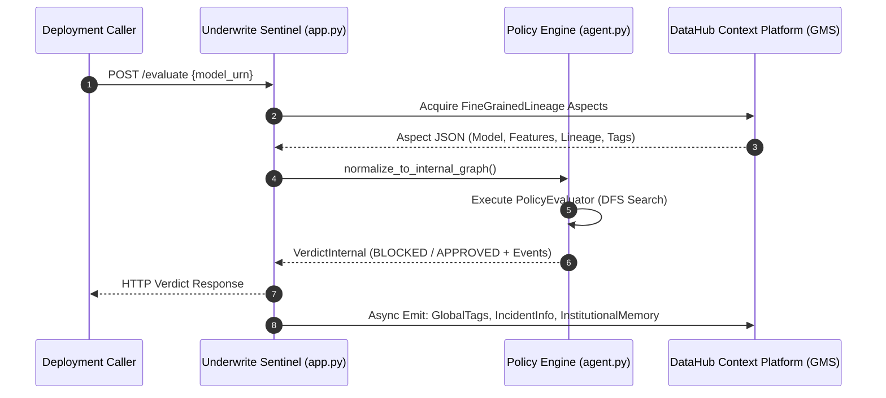

# Underwrite — ML Governance Intercept Agent

[](https://datahubproject.io/)
[](https://opensource.org/licenses/Apache-2.0)
[](https://www.python.org/)
[](https://fastapi.tiangolo.com/)

> **Metadata-driven policy enforcement engine built on DataHub.**  
> *Underwrite turns deployment decisions into persistent governance memory inside DataHub.*

Underwrite is a metadata-driven policy evaluation service built on DataHub. Its `/evaluate` endpoint reads ML-model, feature, dataset, tag, and available fine-grained-lineage aspects through the DataHub Python SDK, evaluates deterministic policies, and returns an approval or block verdict. A caller must enforce that verdict in its own deployment workflow.

---

## 1. The Problem

Target leakage occurs when an ML model relies on features derived from data generated *after* the prediction event occurs. These models often achieve deceptively high validation scores (e.g., 0.99 AUC) during offline training, but fail in production because the leaking feature is invalid or unavailable at inference time.

---

## 2. What Underwrite Does



1. **Evaluates Deployment Requests**: Evaluates a model URN submitted to its HTTP endpoint.
2. **Traverses Lineage**: Reads DataHub aspects through the Python SDK and normalizes dataset and available fine-grained field lineage into an in-memory graph.
3. **Evaluates Policies**: Executes cycle-safe Depth-First Search (DFS) against policy rules loaded from [`policies.yaml`](policies.yaml).
4. **Persists Evidence**: Produces a deterministic verdict (`BLOCKED` or `APPROVED`) and asynchronously emits metadata updates to DataHub entities.

---

## 3. Policy Configuration & Multi-Rule Engine

Policies are configured via [`policies.yaml`](policies.yaml), decoupling graph traversal from policy specification:

```yaml
# policies.yaml
policies:
  - id: ML-LEAK-001
    name: Target Leakage Prevention Policy
    enabled: true
    target_tags:
      - post_outcome
      - is_target
    description: Prevents models from training on features derived from post-outcome datasets.

  - id: ML-TEMPORAL-001
    name: Post-Prediction Tag Policy
    enabled: true
    target_tags:
      - post_prediction
    description: Blocks training provenance carrying the post_prediction tag.

  - id: ML-FAIL-CLOSED
    name: Lineage Provenance Policy
    enabled: true
    description: Blocks models with untracked or unresolvable upstream lineage provenance.
```

---

## 4. System Behavior & Test Coverage Verification

Behavioral verification matrix executed via `python test_full_suite.py`:

| System Behavior | Test Module | Verification Status |
| :--- | :--- | :--- |
| **Target Leakage Detection** | `test_agent.py` | ✅ Verified |
| **Cycle Handling & Depth Cap** | `test_agent.py` | ✅ Verified |
| **Missing Lineage Handling** | `test_agent.py` | ✅ Verified |
| **Fail-Closed Policy Enforcement** | `test_agent.py` | ✅ Verified |
| **Offline Fallback Layer 0 Fixtures** | `test_full_suite.py` | ✅ Verified |
| **Execution Event Serialization** | `test_agent.py` | ✅ Verified for acquisition, normalization, and final decision events |
| **Async Telemetry Write-Back** | `test_writeback.py` | ✅ Verified |

---

## 5. Resilience & Fault Tolerance Strategy

Underwrite implements a 2-layer fallback strategy:

```
[Live DataHub GMS Connection]
               │ (Connection timeout / GMS offline)
               ▼
[Bundled Cached Fixture (cache/verdicts.json)]
```

- **Fail-Closed Governance**: If graph acquisition encounters an unresolvable or untracked data source without metadata provenance, Underwrite returns an `INCOMPLETE_LINEAGE` fail-closed block.
- **Async Write-Back Isolation**: Verdict generation and HTTP response times do not wait for DataHub write-back. The response labels write-back operations as requested, not successful.

---

## 6. Why Lineage Matters

Target leakage features are routinely renamed across dbt staging and mart layers. Flat tag lookups fail; column lineage search succeeds.



---

## 7. System Architecture



---

## 8. Sample Verdict JSON

```json
{
  "model_urn": "urn:li:mlModel:(urn:li:dataPlatform:mlflow,churn_model_v2,PROD)",
  "verdict": "blocked",
  "reason_code": "TARGET_LEAKAGE",
  "evidence_paths": [
    {
      "feature_urn": "urn:li:mlFeature:(churn_features,discount_history)",
      "tainted_urn": "urn:li:schemaField:(urn:li:dataset:(urn:li:dataPlatform:snowflake,raw_billing,PROD),retention_discount)",
      "field_name": "retention_discount",
      "tag_found": "urn:li:tag:post_outcome",
      "path": [
        "urn:li:mlModel:(urn:li:dataPlatform:mlflow,churn_model_v2,PROD)",
        "urn:li:mlFeature:(churn_features,discount_history)",
        "urn:li:dataset:(urn:li:dataPlatform:snowflake,stg_billing,PROD)",
        "urn:li:schemaField:(urn:li:dataset:(urn:li:dataPlatform:snowflake,raw_billing,PROD),retention_discount)"
      ]
    }
  ],
  "execution_events": [
    { "stage": "Acquisition", "step_num": 1, "detail": "Read model, feature, dataset, lineage, and tag aspects from DataHub.", "timestamp": "2026-07-24T16:26:00Z" },
    { "stage": "Normalization", "step_num": 2, "detail": "Normalized the acquired metadata into the policy graph.", "timestamp": "2026-07-24T16:26:00Z" },
    { "stage": "Decision", "step_num": 3, "detail": "Blocked by TARGET_LEAKAGE.", "timestamp": "2026-07-24T16:26:00Z" }
  ]
}
```

Full sample payloads are available in [`examples/verdict_blocked.json`](examples/verdict_blocked.json) and [`examples/verdict_approved.json`](examples/verdict_approved.json).

---

## 9. Quickstart Guide

### 1. Installation
```bash
cd underwrite
python3.12 -m venv .venv
source .venv/bin/activate
pip install -r requirements.txt
```

Run these commands from a clone or extracted release archive of this repository.

### 2. Launch Server
```bash
python app.py
```
Open `http://localhost:8000` in your browser.

The repository does not provision DataHub. To demonstrate live evaluation, point
`UNDERWRITE_GMS_URL` at an already running, authorized GMS instance and ingest
the demo entities with `python seed.py`. Without GMS, the UI labels its bundled
fixtures as cached data; those fixtures are not live DataHub evidence.

### 3. Run Test Suite
Execute the test suite verifying graph traversal and fail-closed policies:
```bash
python test_full_suite.py
```

### 4. Regenerate presentation screenshots (optional)

Start the server in one terminal, then in another terminal install the bundled
Chromium runtime and capture the seven documented assets:

```bash
python -m playwright install chromium
python capture_screenshots.py
```

If the server runs on a different address, set `UNDERWRITE_SCREENSHOT_URL` to
that base URL before running the capture command.

---

## 10. License
Licensed under the [Apache License, Version 2.0](LICENSE).
