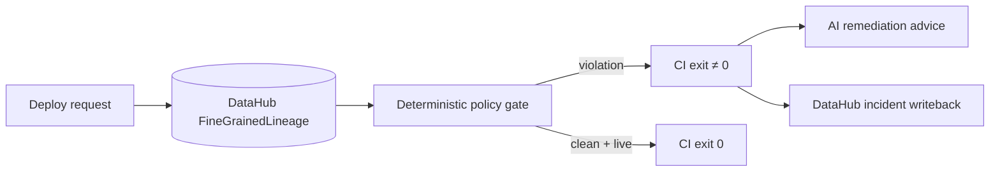

# Underwrite

> **DataHub already knows how your data is connected. Underwrite makes that knowledge enforceable.**

**Verified pin for judges:** tag [`freeze-grand-prize-ready`](https://github.com/Dhruva-Aher/UnderWrite/tree/freeze-grand-prize-ready) (prefer the tag over drifting `main`). Real captured responses, no DataHub required to read them: [`examples/sample_outputs/`](examples/sample_outputs/).

```bash
git clone --branch freeze-grand-prize-ready https://github.com/Dhruva-Aher/UnderWrite.git
```

An ML feature can look safe in code. DataHub shows that three transformations upstream it derives from post-outcome data. Underwrite discovers that lineage and fails CI before the corrupted model deploys.

The console below is a real capture against a seeded DataHub quickstart — the red path is the lineage that caused the block, traced from the model back to a column tagged `post_outcome`.


More captures (all generated by `python scripts/capture_console.py`, which fails if the page logs a single error): [`docs/screenshots/`](docs/screenshots/).

---

## Why CI alone cannot solve this

```text
raw outcome column
      ↓ renamed
      ↓ aggregated
      ↓ feature store
      ↓
   ML model
```

By the time the feature reaches the model, the dangerous relationship is invisible to code review. **Underwrite turns DataHub lineage into a CI authorization boundary** — not a report.

| | Ordinary CI | Underwrite |
| :--- | :---: | :---: |
| Compiles / tests | ✓ | ✓ |
| Reads DataHub fine-grained lineage | ✗ | **✓** |
| Deterministic policy verdict | ✗ | **✓** |
| Blocks unsafe ML deploy (non-zero exit) | ✗ | **✓** |
| Writes incidents back to DataHub | ✗ | **✓** |

**DataHub evidence determines authorization. AI explains remediation.** The LLM cannot decide whether deployment succeeds.

---

## Quick Start (live DataHub — the path judges should run)

Requires DataHub GMS (default `http://localhost:8080`). Python 3.13 recommended.

```bash
python -m venv .venv && source .venv/bin/activate
pip install -r requirements.txt
cp .env.example .env   # set UNDERWRITE_GMS_URL / token if needed

python seed.py         # ingest the demo lineage into GMS
python preflight.py    # starts the API once GMS is healthy
```

These three seeded models cover the decision space. Run the gate against each:

```bash
# 1. Target leakage — exits 1
python scripts/deployment_gate.py \
  --model-urn 'urn:li:mlModel:(urn:li:dataPlatform:mlflow,churn_model_v2,PROD)'

# 2. Clean lineage — exits 0
python scripts/deployment_gate.py \
  --model-urn 'urn:li:mlModel:(urn:li:dataPlatform:mlflow,recommendation_model_v1,PROD)'

# 3. Unresolvable lineage — exits 1, fail-closed
python scripts/deployment_gate.py \
  --model-urn 'urn:li:mlModel:(urn:li:dataPlatform:mlflow,fraud_model_v3,PROD)'
```

Scenario 1 traverses DataHub fine-grained lineage from the model back to a column
tagged `post_outcome`, prints the evidence path with a browsable DataHub link,
writes an incident back to the offending dataset, and exits non-zero.

**Exit 0 requires `verdict == approved` *and* `evaluation_source == live_datahub`.**
A model that looks clean because GMS was unreachable is blocked, not approved —
scenario 3 exists to prove that.

### The console

With the API up, open <http://127.0.0.1:8000>. It renders the same `/evaluate`
response the gate consumes; nodes on the evidence path are drawn in red.


The console never invents a connection: it displays `evaluation_source` verbatim,
and its write-back panel polls for the real outcome rather than claiming success.

### Offline fixture (reproducibility only)

```bash
python demo/run_demo.py --offline
```

This uses an in-memory mock. It is **not** a live DataHub evaluation, and the gate
will refuse to approve on it. Prefer the live path above for judging.

---

## API

| Endpoint | Purpose |
| --- | --- |
| `POST /evaluate` | Acquire lineage, evaluate policies, return the verdict and its evidence |
| `GET /writeback/{request_id}` | Real outcome of the background DataHub write-back for that evaluation |
| `POST /remediation/{decision_id}` | LLM remediation advice for a blocked decision — advisory only |
| `POST /override` | Record a signed human override; requires `UNDERWRITE_OVERRIDE_TOKEN` |
| `GET /health` | Reports whether GMS is reachable |

Write-back is a pure side effect. It runs after the response is sent and can fail
without changing a verdict that was already issued.

---

## Configuration

Set in `.env` or the environment.

| Variable | Default | Purpose |
| --- | --- | --- |
| `UNDERWRITE_GMS_URL` | `http://localhost:8080` | DataHub GMS endpoint |
| `UNDERWRITE_DATAHUB_TOKEN` | — | Personal access token, if GMS requires auth |
| `UNDERWRITE_MAX_LINEAGE_DEPTH` | `6` | Traversal depth bound |
| `UNDERWRITE_POLICY_PATH` | `policies.yaml` | Policy definitions |
| `UNDERWRITE_OVERRIDE_TOKEN` | — | Enables `/override`; overrides are disabled without it |
| `UNDERWRITE_DATAHUB_UI_URL` | `http://localhost:9002` | Used by the gate to print browsable entity links |
| `UNDERWRITE_REQUESTED_BY` | CI actor, else `ci-deployment-gate` | Principal recorded in the audit trail |

---

## Tests

```bash
pytest
```

68 tests, no network required. They cover the fail-closed boundaries (a blocked
verdict cannot be rendered as approved, the gate cannot exit 0 on a non-live
source), URN handling, and a check that the write-back operations advertised in
the UI are exactly the ones the executor performs.

---

## Architecture (five stages)

**Acquisition → Normalization → Traversal → Evaluation → Verdict**



Full design notes: [`docs/ARCHITECTURE.md`](docs/ARCHITECTURE.md) · algorithm: [`docs/algorithm.md`](docs/algorithm.md)

---

## Development

The console is a Vite/React app in `web/frontend`. FastAPI serves a prebuilt,
content-hashed bundle from `web/static`, so rebuild after any UI change:

```bash
./scripts/build_frontend.sh    # build and sync into web/static
```

To refresh the screenshots in `docs/screenshots/`, with the API running:

```bash
python scripts/capture_console.py
```

It drives both paths in a real browser and exits non-zero on any page error,
console error, or failed request — a screenshot cannot be captured from a broken
page. Sample outputs in `examples/sample_outputs/` are regenerated the same way,
by piping live responses to disk; see the README there.

---

## FAQ

**Is this just a leakage detector?**  
No. Target leakage is the demonstrated policy. The product is **metadata-backed deployment policy enforcement** — DataHub decides; CI enforces.

**Why not ask an LLM whether the model looks dangerous?**  
Authorization must be deterministic and fail-closed. AI runs only after a block, read-only via Agent Context Kit.

**What happens if DataHub is down?**  
Every deployment is blocked. There is no cached approval path, because an approval
issued without evidence is indistinguishable from one that was never checked.

**Can someone bypass a block?**  
Only through `/override`, which requires a preconfigured token and records a named
signer. It is disabled entirely unless `UNDERWRITE_OVERRIDE_TOKEN` is set.

---

## License

Apache 2.0
