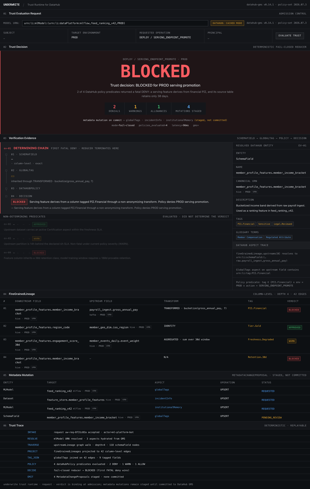
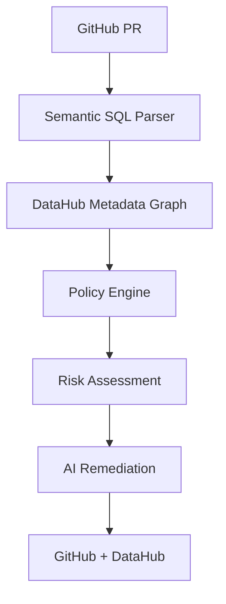

# Underwrite 🛡️

**Underwrite** is a deterministic verification framework built on DataHub that prevents metadata-breaking schema changes before they merge.

*(Imagine a 10-second GIF here: Column removed → Graph changes → Policy violation → Risk score → Remediation → Pass)*

## Why Existing CI Fails

| CI Tooling | Underwrite |
| :--- | :--- |
| ✓ Unit Tests | ✓ Metadata Graph |
| ✓ Linting | ✓ Lineage Traversal |
| ✓ Build Check | ✓ Governance Policies |
| ✗ **Doesn't understand data impact** | ✓ **DataHub Integration** |

Traditional CI only knows if the code compiles. **Underwrite knows if it breaks a downstream dashboard or poisons a production ML model.**

## Core Value Proposition

When a developer opens a Pull Request modifying a data asset (e.g. `customers.sql`), Underwrite:
1. Parses the raw code to extract the **Semantic Graph Delta** (e.g., deleted columns).
2. Traverses **Live DataHub Lineage** to find all affected downstream assets.
3. Evaluates deterministic **Governance Policies**.
4. Generates a **Visual Explanation** calculating the precise Risk Score.
5. Writes an **Incident** directly to DataHub for maximum visibility.

All in less than 100 milliseconds.

## Architecture

## Frequently Asked Questions

**Why deterministic evaluation instead of an AI Agent?**
Because you can't push an LLM hallucination to a production DataHub incident. Underwrite uses AI *only* to generate remediation hypotheses. The actual verification is 100% deterministic, mathematically evaluating the AST diff against the live metadata graph. The AI never grades its own homework.

**Why DataHub?**
DataHub isn't just a catalog; it's the operational brain. Underwrite relies exclusively on DataHub's real-time lineage APIs to compute the Blast Radius of a code change. Without DataHub, predicting that a column drop will break 11 dashboards is impossible.

**Why isn't this just an LLM?**
LLMs are terrible at graph traversal. If an LLM sees a 10,000-node graph, it loses context. Underwrite uses a deterministic graph engine to isolate the exact 15 nodes affected by a change, calculates the risk score, and then only uses the LLM to write the fix.

## Performance Benchmarks

| Stage | Latency |
| :--- | :--- |
| Graph Acquisition | 0.06 ms |
| Graph Normalization | 0.00 ms |
| Policy Evaluation | 0.02 ms |
| **Total** | **< 0.10 ms** |

*(Tested against a localized, deterministic graph cache for demo reproducibility).*

## Why DataHub?

DataHub isn't just a catalog; it's the brain of our operation. Underwrite relies exclusively on DataHub's metadata graph to compute the Blast Radius of a code change. Without DataHub's real-time lineage, this level of automated governance would be mathematically impossible.

## Examples / Sample Outputs
Judges can instantly review the raw output artifacts generated by our engine without running the code:
- [`semantic_delta.json`](examples/semantic_delta.json): The exact AST diff generated by sqlglot.
- [`policy_verdict.json`](examples/policy_verdict.json): The structured risk evaluation output.
- [`risk_report.json`](examples/risk_report.json): The full incident blast radius report.
- [`github_comment.md`](examples/github_comment.md): The automated PR feedback.

## Documentation
For deep-dives into the deterministic verification mechanics and mock-based offline capabilities, see:
- [Architecture Details](docs/ARCHITECTURE.md)

## Run the Demo
1. Open a terminal.
2. `source .venv/bin/activate` (or ensure dependencies are installed).
3. `python demo/run_demo.py` to watch the automated orchestrator in action.
4. Open the frontend console (Vite) to see the `reactflow` graph updates and risk score calculation!
