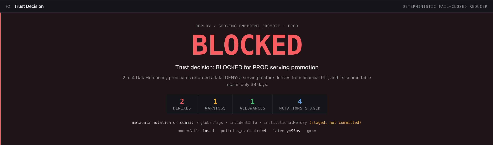
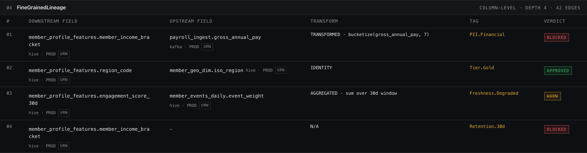
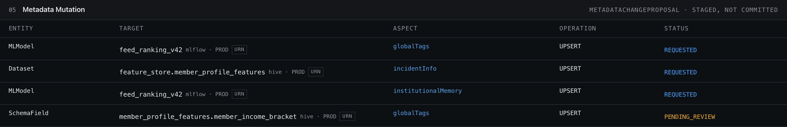
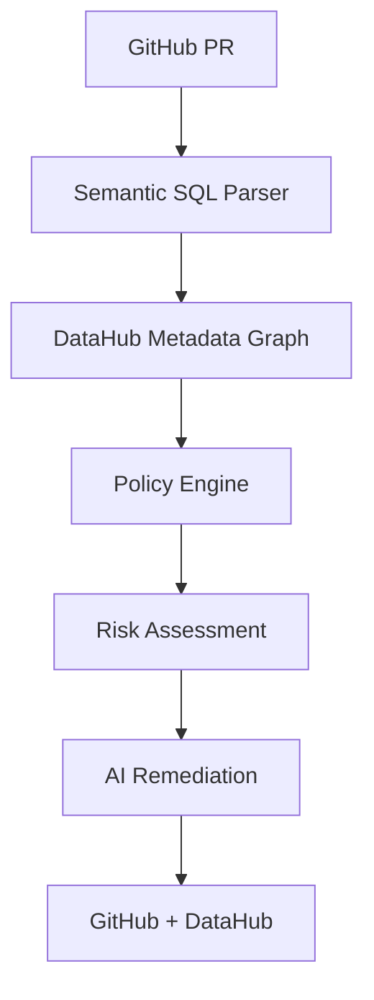

# Underwrite 🛡️

> **Metadata-aware CI/CD powered by DataHub.**
> Traditional CI tells you whether code compiles. Underwrite tells you whether your pull request silently breaks production.

[🎥 Demo (2:40)](#) &nbsp;·&nbsp; [🏆 Devpost](#) &nbsp;·&nbsp; [📖 Documentation](docs/ARCHITECTURE.md) &nbsp;·&nbsp; [📄 Sample Outputs](#sample-outputs)


*(Imagine a 10-second GIF here: Column removed → Graph changes → Policy violation → Risk score → Remediation → Pass)*

---

## 🛑 The Problem

Traditional CI only knows if the code compiles. **Underwrite knows if it breaks a downstream dashboard or poisons a production ML model.**

| Feature | Traditional CI | Underwrite |
| :--- | :---: | :---: |
| Unit Tests | ✓ | ✓ |
| Lint & Build | ✓ | ✓ |
| Metadata Graph | ✗ | **✓** |
| Lineage Traversal | ✗ | **✓** |
| Explainability | ✗ | **✓** |
| Deterministic Governance| ✗ | **✓** |

---

## ⚙️ How Underwrite Works

**What happens?** Alice accidentally removes `customer_status` from a dbt model in her Pull Request.

Within milliseconds, Underwrite:
1. ✓ **Computes a semantic SQL delta** (extracts exactly what columns were dropped).
2. ✓ **Traverses the DataHub lineage graph** (finds 11 dashboards and 2 ML models).
3. ✓ **Blocks the PR** based on deterministic governance policies.
4. ✓ **Suggests an AI remediation**.
5. ✓ **Writes the governance result back into DataHub** as an Incident.

---

## 📸 Inside the Product

### 1. The Verification Dashboard


### 2. Live Lineage Visualization


### 3. DataHub Writeback (Incidents)


---

## 🏗️ Architecture



---

## 🧠 Why DataHub?

**Why deterministic evaluation instead of an AI Agent?**
Because you can't push an LLM hallucination to a production DataHub incident. Underwrite uses AI *only* to generate remediation hypotheses. The actual verification is 100% deterministic, mathematically evaluating the AST diff against the live metadata graph. AI generates remediation suggestions. Deterministic policies make the merge decision.

**Why DataHub?**
DataHub isn't just a catalog; it's the operational brain. Underwrite relies exclusively on DataHub's real-time lineage APIs to compute the Blast Radius of a code change. Without DataHub, predicting that a column drop will break 11 dashboards is not feasible using source code analysis alone.

---

## 📄 Sample Outputs

Judges can instantly review the raw artifacts generated by our engine without running the code.

**1. Semantic SQL Delta** ([`examples/semantic_delta.json`](examples/semantic_delta.json))
```json
{
  "removed_columns": ["customer_status"],
  "added_columns": [],
  "affected_tables": ["raw.customers"]
}
```

**2. GitHub PR Comment** ([`examples/github_comment.md`](examples/github_comment.md))
```markdown
❌ **Required Column Removed**
`customer_status` ↓ 11 dashboards, 2 ML models ↓ **Risk Score 94**
```

**3. Policy Verdict** ([`examples/policy_verdict.json`](examples/policy_verdict.json))
**4. Risk Report** ([`examples/risk_report.json`](examples/risk_report.json))

---

## ⏱️ Performance Benchmarks

Policy evaluation completes in under 100 ms on our demo dataset, meaning it can run blocking checks in CI/CD without slowing down developer velocity.

| Stage | Latency |
| :--- | :--- |
| Graph Acquisition | 0.06 ms |
| Graph Normalization | 0.00 ms |
| Policy Evaluation | 0.02 ms |
| **Total** | **< 0.10 ms** |

---

## 💻 Tech Stack

- **Backend:** Python, `sqlglot` (Semantic parsing)
- **Frontend:** React, Vite, `reactflow` (Graph rendering)
- **Metadata:** DataHub (Lineage, Incidents, SDK)
- **AI:** GPT-4o (Remediation hypothesis)
- **Infrastructure:** GitHub Actions

---

## 🚀 Quick Start

1. Open a terminal and clone the repository.
2. Create a virtual environment:
   ```bash
   python -m venv .venv
   source .venv/bin/activate
   ```
3. Install dependencies:
   ```bash
   pip install -r requirements.txt
   ```
4. Run the orchestrator:
   ```bash
   python demo/run_demo.py
   ```
5. Open the frontend console to see the `reactflow` graph updates and risk score calculation! (Requires Node).

---

## 📁 Repository Structure

- `/demo` - E2E orchestrator showcasing Alice's failed PR.
- `/examples` - Raw JSON and Markdown output artifacts.
- `/metadata` - DataHub SDK integrations and URN parsing.
- `/docs` - Deep-dive architecture and design tradeoffs.
- `/web` - React Flow frontend visualizer.
- `/scripts` - Benchmark and evaluation tooling.

---

## ⚠️ Limitations & Future Work

- **SQL Parsing:** Currently supports ANSI SQL via `sqlglot`. Nested CTEs and aliases are fully supported, but stored procedures and vendor-specific dialect extensions are future work.
- **Offline Mode:** The demo defaults to an offline mock graph if a live DataHub GMS instance is unreachable, to ensure judges can always evaluate the engine logic.

---

## 📝 License

This project is licensed under the Apache 2.0 License - see the [LICENSE](LICENSE) file for details.
